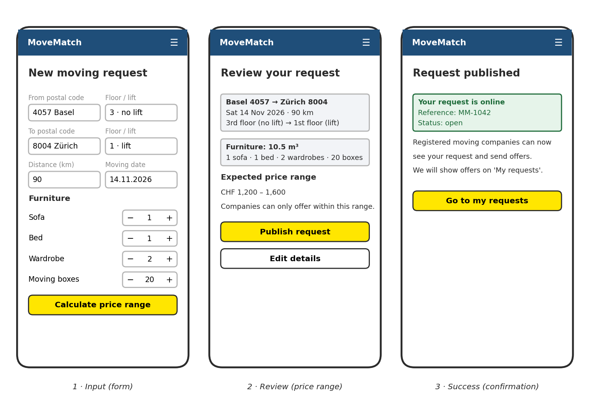
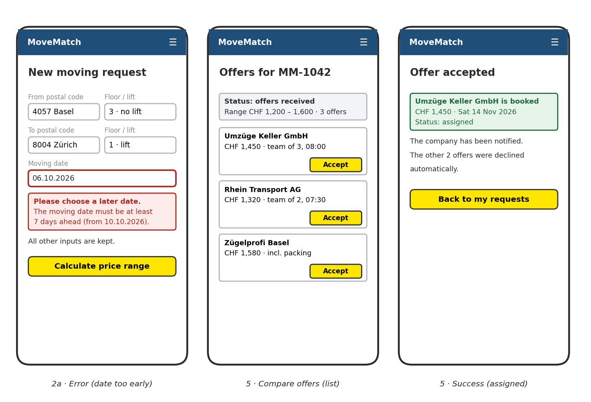
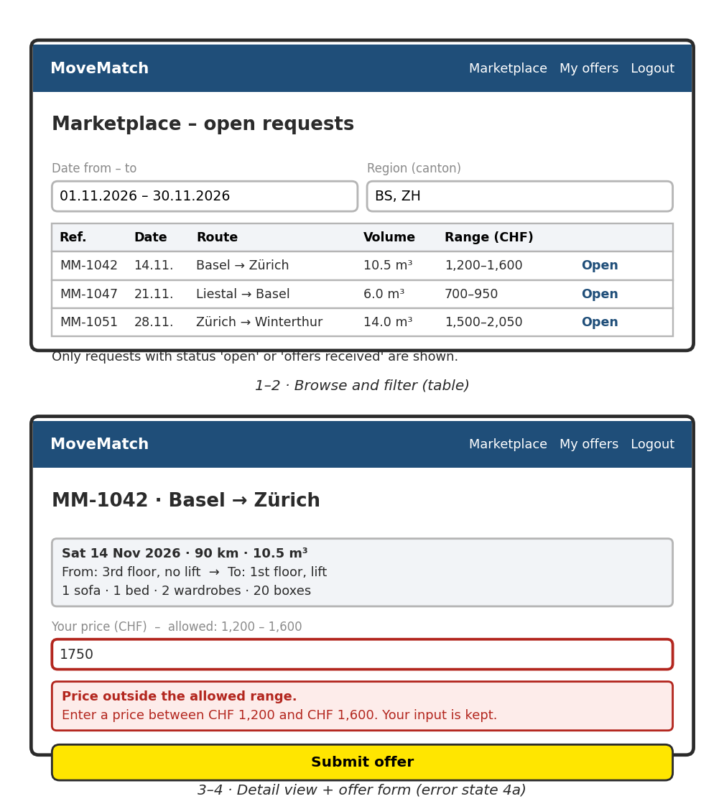
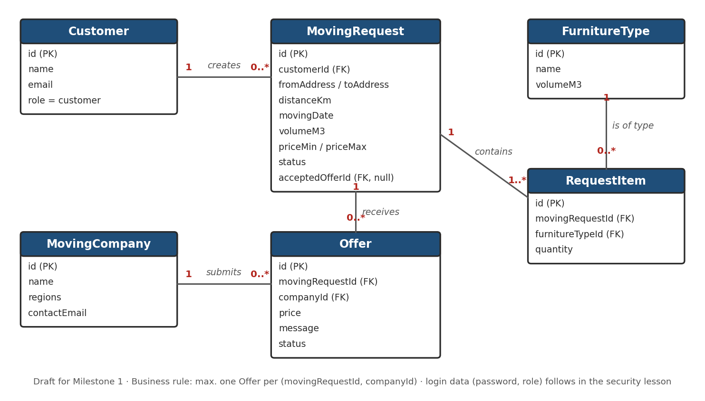

# MoveMatch

**Current stage:** Milestone 1 — design draft. This README is updated throughout the project; we do not start a separate document for each milestone.

Later sections (implementation, execution) will be added from the fourth theory session onwards. This version documents our design draft: drafts and open questions are expected; there is no running backend, database or complete OpenAPI contract yet.

## Project overview

MoveMatch is a web marketplace for private moves. Today, people who move contact five to ten moving companies one by one, fill in a different form each time and wait for replies. Many companies have no capacity on the requested date, and the quotes are hard to compare because each company asks for different details. Companies, in turn, lose time on incomplete requests.

With MoveMatch, a customer describes the move **once** in a standard form (addresses, distance, date, floor, lift and the number of specific furniture items). The application calculates a price range that leaves room for negotiation and publishes the request on a marketplace. Registered moving companies browse the requests, submit one offer within the range, and the customer accepts the offer that fits best.

**Intended users:** private customers who are planning a move, and dispatchers of small and medium moving companies.

### Team and initial responsibilities

| Member | Initial responsibility | Next action |
|---|---|---|
| Blenoard | Coordination and README | Keep decisions, questions and the milestone commit together; submit the repository link in Moodle |
| Younes   | Users and workflow | Refine workflows A–B and the business rules after coaching |
| Leutrim  | Sketches and interaction | Turn the sketches into a clickable prototype (Exercise 3) |
| Salahdin  | Data and API exploration | Maintain the sample JSON in `data/`; prepare the first OpenAPI draft for Milestone 2 |

These are starting responsibilities, not permanent silos. Everyone reviews the whole draft and should be able to explain it in coaching.

## 1. Analysis

### Scenario, users and goals

- **Situation or problem:** A person moving from Basel to Zürich has to contact many companies, repeat the same information in different forms and compare quotes that are based on different assumptions. Moving companies receive incomplete enquiries and requests for dates on which they are already fully booked.
- **Intended users:**
  - *Customer* (e.g. Lena, private person): wants to describe the move once and receive comparable offers.
  - *Moving company* (e.g. the dispatcher of Umzüge Keller GmbH): wants complete, comparable requests to fill free days in the schedule.
  - *Admin*: optional, later (e.g. company verification).
- **Proposed benefit:** one standard request instead of ten; offers only from companies with capacity; comparable offers within a transparent price range; less time spent on incomplete enquiries.
- **Initial scope:** Workflow A (customer publishes a request) and Workflow B (company submits an offer), plus accepting an offer.
  - *Left out for now:* online payment (needs a payment provider and legal checks), chat or live negotiation (the price range covers negotiation), automatic distance via a maps API (customers enter postal codes and an approximate distance), reviews and ratings (only useful once real moves happened), company verification (we assume registered companies are legitimate).

### User stories and first workflow

**Customer**

- As a customer, I want to describe my move once in a standard form, so that I do not have to fill in a different form for every company.
- As a customer, I want to see an expected price range before publishing, so that I know what the move will roughly cost.
- As a customer, I want to compare offers and accept one, so that my move is booked with a company that has capacity on my date.
- As a customer, I want to withdraw my request before accepting an offer, so that companies stop sending offers if my plans change.

**Moving company**

- As a dispatcher, I want to filter open requests by date and region, so that I only see jobs that fit our free days.
- As a dispatcher, I want to see all details of a request (floors, lift, furniture), so that I can make a realistic offer without calling back.
- As a dispatcher, I want to submit an offer within the price range, so that the customer can compare it fairly with other offers.

**Workflow A — customer publishes a moving request (Lena, Basel → Zürich)**

| Step | User / role | Action | Information needed | Expected result or feedback |
|---|---|---|---|---|
| 1 | Customer | Enter the move details | From/to postal code and city, floor, lift, distance (km), moving date, quantity of sofas, beds, wardrobes and boxes | Input is kept ready to submit |
| 2 | Customer | Submit the form ("Calculate price range") | The entered data | Required fields checked; moving date at least 7 days ahead |
| 3 | Customer | Review the summary | — | Route, date, volume (10.5 m³) and price range (CHF 1,200–1,600) are shown |
| 4 | Customer | Publish the request | Confirmation | Request saved with status `open` and reference MM-1042; listed on the marketplace |
| 5 | Customer | Open the offers and accept one (after confirming) | Chosen offer | Request `assigned`; chosen company notified; all other offers `declined` |
| 2a | Customer | Submit with a date only 3 days ahead | — | Message explains the 7-day minimum; other input is kept; no request is created |

**Workflow B — moving company submits an offer (Umzüge Keller GmbH)**

| Step | User / role | Action | Information needed | Expected result or feedback |
|---|---|---|---|---|
| 1 | Company | Open the marketplace | — | Open requests with date, route, volume and price range |
| 2 | Company | Filter by date and region | Date range, cantons | Only matching requests are shown |
| 3 | Company | Open one request | — | All details and the allowed price range |
| 4 | Company | Enter a price and submit the offer | Price (CHF), optional message | Price checked against the range; check that the company has no offer on this request yet |
| 5 | Company | Read the confirmation | — | Offer saved as `pending`; request changes to `offers_received` |
| 4a | Company | Enter CHF 1,750 (above the range) | — | Allowed range is shown; input kept; offer not saved |

**Questions and exceptions worth discussing**

- What happens if a company cannot do the job after its offer was accepted (e.g. the truck breaks down a week before)? 
- What if the customer notices more furniture after offers arrived? Draft decision: editing is only allowed while the request is `open`; afterwards the customer withdraws and creates a new request.

## 2. Design

### Screens and navigation

Digital versions of our sketches:

*Workflow A on a phone: the form, the review with the price range and the confirmation are states of one "new request" flow.*

*Error state 2a (date too early, other input kept), the list of offers as cards, and the confirmation after accepting.*

*Workflow B on a desktop: the marketplace table with filters, and the request detail with the offer form in error state 4a.*

**Main inputs, actions and feedback**

- Customers mostly use a **phone**: one column, +/− steppers for furniture, a highlighted price range, buttons with clear verbs ("Calculate price range", "Publish request").
- Dispatchers mostly use a **desktop**: a table to compare many requests, filters for date and region, a price field labelled with the allowed range.
- Errors appear directly at the affected field, explain how to fix the problem and keep all other input. Accepting an offer needs a confirmation because it cannot be undone.

**Navigation (draft)**

| View | Role | Main actions |
|---|---|---|
| Start page | Visitor | Explains how MoveMatch works; log in / register (later) |
| My requests | Customer | Open a request; create a new request |
| New request (form → review → confirmation) | Customer | Calculate range; edit; publish |
| Request detail with offers | Customer | Accept an offer; withdraw the request |
| Marketplace | Company | Filter; open a request |
| Request detail + offer form | Company | Submit an offer |
| My offers | Company | See the status of own offers |

A clickable prototype (Bootstrap Studio) is planned but not yet available. The frontend technology is still undecided.

### Domain concepts and example data

All example data is fictional.

| File | Content |
|---|---|
| [`data/furniture-types.json`](data/furniture-types.json) | Catalogue of furniture types with their volume in m³ |
| [`data/create-moving-request.json`](data/create-moving-request.json) | What the customer sends when creating a request |
| [`data/price-estimate.json`](data/price-estimate.json) | How the price range for this request is calculated |
| [`data/moving-request.json`](data/moving-request.json) | The saved request as the app returns it |
| [`data/moving-company.json`](data/moving-company.json) | A registered moving company |
| [`data/create-offer.json`](data/create-offer.json) / [`data/offer.json`](data/offer.json) | An offer as sent by the company and as saved |
| [`data/error-examples.json`](data/error-examples.json) | Planned error responses for the main business rules |

**Important fields and types**

- `movingDate` is a string in ISO format (`"2026-11-14"`), because JSON has no date type; the backend converts it to check the 7-day rule.
- `fromAddress` / `toAddress` are objects, because postal code, floor and lift are used separately (region filter, floor surcharge).
- `items` is an array of `{ "furnitureTypeId", "quantity" }`. Each item **refers** to the furniture catalogue by ID instead of a name, so that names can change and the volume is defined in one place. The quantity belongs to the item, not to the furniture type.
- Units are part of the key name (`distanceKm`, `volumeM3`); prices are whole CHF with a separate `currency` field.
- An offer references its request (`movingRequestId`) and company (`companyId`). `acceptedOfferId` is `null` until the customer accepts an offer.
- Status values: request `open`, `offers_received`, `assigned`, `completed`, `withdrawn`; offer `pending`, `accepted`, `declined`.

**Uncertainties**

- One `User` table with a role, or separate customer and company tables?
- Are whole francs sufficient, or do we need centimes?
- Is a manually entered `distanceKm` acceptable, or do we use a postal-code distance table?

### Business rules and possible operations

**Rules (draft)**

1. The moving date lies at least 7 days in the future. *Exception:* a date 3 days ahead is rejected with an explanation; the other input is kept.
2. Quantities are whole numbers ≥ 0, and at least one item has a quantity ≥ 1.
3. The price range is calculated as estimate ± 15 %, rounded inwards to CHF 50. Draft estimate: base price CHF 350 + CHF 3 per km + CHF 60 per m³ + CHF 50 per floor without lift. Lena's move: 350 + 270 + 630 + 150 = CHF 1,400 → range CHF 1,200–1,600.
4. A company offer must lie within the range of the request.
5. A company can submit only one offer per request.
6. Offers are only possible while the request is `open` or `offers_received`.
7. When the customer accepts an offer, the request becomes `assigned` and all other offers become `declined`.
8. A request can only be edited while it is `open`, and withdrawn as long as it is not `assigned`.

The frontend checks rules 1, 2 and 4 early for better feedback, but the backend service logic is the authority, because the API can also be called without our frontend. Where the implementation enforces each rule will be documented later.

| User goal | Proposed action | Example input | Expected output | Open question |
|---|---|---|---|---|
| Publish a move | Create a moving request | `data/create-moving-request.json` | Saved request with reference, volume, price range, status `open` | Is a manual distance acceptable? |
| Find suitable jobs | Read open requests (with filters) | Date range, region | List of requests with date, route, volume, range | Filter by canton or by postal code range? |
| Inspect a job | Read one request | Request ID 1042 | All details incl. range; no contact data before acceptance | — |
| Correct a mistake | Change a request | Changed furniture list | Updated request and recalculated range — only while `open` | Allow changes after offers? |
| Cancel a move | Remove (withdraw) a request | Request ID | Status `withdrawn`; pending offers declined | Soft delete (status) or real delete? |
| Make an offer | Create an offer | `data/create-offer.json` | Offer `pending` — or error: outside range / already offered | Can a company change its offer? |
| Compare offers | Read offers of my request | Request ID | List of offers with company, price, message | Sort by price only? |
| Book a company | Accept an offer | Offer ID 311 | Request `assigned`, others `declined` | `PATCH` status or explicit action endpoint? |

These are draft ideas in plain language, not implemented endpoints. Final endpoints and the OpenAPI contract follow after coaching (Milestone 2).
 
 
## 3. Project management
 
### Decisions, open questions and next steps
 
| Question / decision | Current position | Next step / person |
|---|---|---|
| Scope of version 1 | Decided: Workflows A and B plus accepting an offer; payment, chat, maps API, reviews and verification are out | Confirm in coaching — [Name] |
| Distance | Customer enters an approximate value in km | Ask in coaching; check a postal-code table as alternative — [Name] |
| Price formula and rates | Draft (see business rule 3) | Validate rates with one real quote or a moving company website — [Name] |
| Who sets a request to `completed`? | Undecided | Discuss in coaching — [Name] |
| Company cancels after assignment | Out of scope for version 1 | Discuss in coaching — [Name] |
| Can a company change or withdraw a pending offer? | Undecided | Decide before Milestone 2 — [Name] |
| Accepting an offer as an API operation | Tendency: explicit action endpoint | Decide when writing the OpenAPI contract — [Name] |
| User table(s) and roles | Undecided | Decide in the persistence/security lessons — [Name] |
| Frontend technology | Undecided (allowed at this stage) | Decide before the integration milestone — [Name] |
| API testing with Postman | Not done yet — none of us has worked with Postman so far | Send our sample JSON (`data/create-moving-request.json` and an offer) to a simple echo endpoint and record what comes back, before the backend milestone — [Name] |
| Comparing external APIs (e.g. a distance/maps service) | Not done yet | Only relevant if we pursue the distance extension above — [Name] |
 
### Milestone progress
 
| Milestone | Available evidence | Status / next step |
|---|---|---|
| 1 — Design draft | Analysis, workflows A and B, sketches in `sketches/`, sample JSON in `data/`, proposed operations, open questions | Draft committed; record changes agreed in coaching |
| 2 — Contract and available implementation | OpenAPI contract and implemented/tested progress | Update later |
| Integration — later | Revised feature scope, frontend decision, architecture and a connected workflow | Update later |
 
Contributions and decisions are described in this README; commit counts are not a measure of individual effort.

### Milestone progress

| Milestone | Available evidence | Status / next step |
|---|---|---|
| 1 — Design draft | Analysis, workflows A and B, sketches in `sketches/`, sample JSON in `data/`, proposed operations, open questions | Draft committed; record changes agreed in coaching |
| 2 — Contract and available implementation | OpenAPI contract and implemented/tested progress | Update later |
| Integration — later | Revised feature scope, frontend decision, architecture and a connected workflow | Update later |

Contributions and decisions are described in this README; commit counts are not a measure of individual effort.

## 4. References and acknowledgements

- Course material Web-based Applications HS26 (FHNW, Dr. Devid Montecchiari): "Networks, the Web and APIs", "Web engineering and application design", "API design and lifecycle", project assignment and Milestone 1 README template.
- Sketches and the data model diagram were drawn digitally; parts of the text and sketches were drafted with AI assistance (Claude) and reviewed and adapted by the team.

Template lineage: the earlier [Pizzeria Reference Project](https://github.com/FHNW-INT/Pizzeria_Reference_Project) organised documentation around analysis, design, implementation, execution and project management. This template updates that structure for the HS26 Python/FastAPI teaching path.
 

